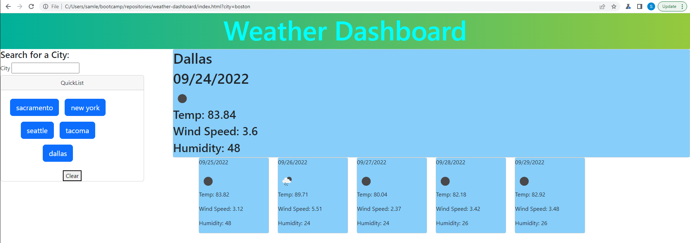

# weather-dashboard# <Weather Dashboard>

## Description

This is a project that was created to serve as a weather forecasting tool. The user can search for a particular city to get a total of 6 days forecast, including today. This project was created with an emphasis on server side APIs, calling an API with an API key, and using the received data in the code. In this case, 2 APIs were called from website ‘openweathermap’ to receive and display weather forecasting data. 

## Installation

This is a project that is available online via weblink.
https://samlee088.github.io/work-day-scheduler/
Additionally, the back-end coding is available for download through github.
https://github.com/samlee088/work-day-scheduler

## Usage

To search for a city, the user inputs a city name into the input search on the upper left hand side of the webpage. If the city name can successfully load data from the APIs, then the city will be added as a ‘quicklist’ option, additionally displaying the current weather and further 5-day forecast. The user can also clear out the ‘quicklist’ list with the ‘clear’ button.

## Credits

NA

## License

NA

---

